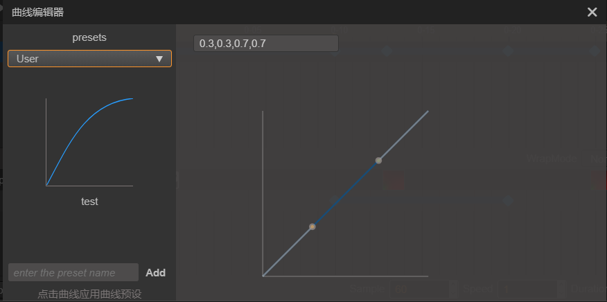

# Editing Animation Curves

We have created a basic animation in previous sections of this documentation.
However, sometimes we need to implement __easing effects__, such as __EaseInOut__ between two __key frames__. How is this achieved in the animation editor?

__First__, __two unequal key frames__ need to be created on a track, such as __two key frames__ on position, from __0,0__ to __100,100__.

__Next__, a connecting line will appear between the __two key frames__ (the blue line segment connecting the __key frames__). __Double-click__ the connecting line to open the __Curve Editor__.

When the __Curve Editor__ is open, if the current animation curve data is in a preset, the corresponding item on the left of the preset will have a golden border to show it's selected effect. The modification of the animation curve is real-time, there is no need to click save. After modifications, click the close button in the upper right corner.

## Using preset curves

__Presets__ can be selected on the left side of the __Curve Editor__. For example, __Ease In__, can be applied to the current animation curve by clicking the corresponding curve.

## Custom curves

Sometimes, when the __preset curve__ can not meet the needs of the animation, we can also modify the curve ourselves. In the preview curve of the __Curve Editor__, there are two gray control points. Drag the control point to change the curve's trajectory. If the control point needs to be dragged out of view, the __mouse wheel__ can be used to __zoom__ the preview.

The curve data during the modification process will be displayed in the input box in the upper left corner of the curve area in real time, and the input box also supports **manual input of curve data to generate a curve**, of course, the format of the curve data must be four numbers in __CSV__ format (__commas separated value format__) with, otherwise it cannot be applied normally.

## Save custom curve
Sometimes some custom curve data required by the project needs to be reused, it can be saved in the preset library of User. Specifically, after editing the curve data to be saved, select the User option in the preset menu at the upper left and enter the name of the curve data to be saved in the input box at the lower left, and click add to add.

> **Note**: the curve with the same name will be overwritten, and the custom curve is saved without undo processing, so if it is overwritten, it needs to be added again.

The custom curve saved in the preset is the same as the preset curve of other libraries, click to apply. At the same time, when the mouse moves over the curve, a __delete icon__ will appear. __Click__ to __delete__ the corresponding curve data.

For more about the design of animation curve and script control code, please refer to the [Animation Curve](./../../engine/animation/animation-clip.md) documentation.
