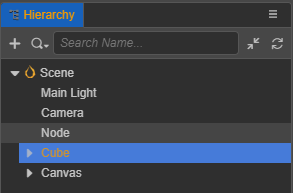
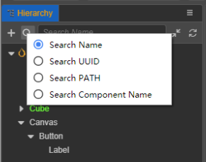

# Hierarchy Panel

The **Hierarchy** panel is the panel used to show the hierarchical relationship of most nodes in the current scene. There are some nodes in the scene that do not need to be displayed, which are generally the necessary factors to support the display of the scene, but they are not operable and can be ignored by the user. If there is a plug-in, you can see the details of the plug-in.

You can *select*, *create*, *move*, *rename* or *delete* nodes in the **Hierarchy** panel. Any node can create a child node. The coordinate system of the child node is relative to the parent node.

## Hierarchy Manager introduction

The **Hierarchy** panel contains a top menu area and a bottom tree list area on the panel:

  - The functions of the top menu are: **New Node Button**, **Search Type Button**, **Search Box**, **Fold All or Expand Button**, **Refresh List Button**.
  - The tree-like list area at the bottom mainly reflects the hierarchical relationship of nodes. The root node is **scene node**. When editing the prefab file, is the root node **scene node**, but the top node of itself. There is a blank area with a height of 20px at the end of the tree-shaped area. Click here to **uncheck**, that is, the **Hierarchy** panel can have no selected items.
  - The panel supports right-click menus, and the content of right-click menus in different positions and nodes will be different.
  - The panel supports keyboard shortcuts:

    - *Copy*: Ctrl or Cmd + C
    - *Paste*: Ctrl or Cmd + V
    - *Duplicate*: Ctrl or Cmd + D, Ctrl + drag node
    - *Delete*: Delete
    - *Up and down selection*: up and down arrows
    - *Collapse of nodes*: left arrow or Backspace
    - *Expansion of nodes*: right arrow or Enter
    - *Multi-select*: Ctrl or Cmd + click
    - *Multi-select*: Shift + click
    - *Rename*: Enter/F2
    - *Cancel*: input: Esc

## New Node

Click the **New Node button** When adding a node, a **input box** will appear first. It is required to fill in the name of the node. The name of the node is allowed to be empty. If an item is not selected in the tree list, it will be newly created at the current root node by default. If there are multiple selected items, it will be newly created at the first selected node.

In addition, there is a **New** entry in the right-click menu of the node.

For the UI node, in order for it to display properly, at least one of its parent nodes must contain a **UITransform** component, so when it is created, if it does not meet the rules, it will assist in adding a **Canvas** node as it's parent.

In addition, a node can be generated by dragging a **prefab** asset from the **Asset Manager** to the **Hierarchy** panel.
You can generate a asset by dragging a **prefab** node into the **Asset Manager** through the **Hierarchy** panel.

## Moving a Node

The movement is divided into **moved node** and **target placement node**, in which the height of **target placement node** is identified in three parts: *upper*, *middle*, and *lower*. These indicate:

- On the upper side, move the **moved node** above the **target placement node**, the two are level.
- In the middle, move the **moved node** to the **target placement node**, at the end.
- On the lower side, move **the moved node** below the **target placement node**, the two are level.

## Searching for a  Node

The search types are: **search name**, **search UUID**, **search path** and **search component name**. **search component name** is the search node component. The component name can be viewed in the **Inspector** panel, as **MeshRenderer**.

The **Search box** is searched in real time. When a node is selected in the search results, after clearing the search content, it will be relocated to the selected node.

## Renaming a node

Select a node, press the shortcut key **Enter** or **F2**, or right-click the menu and select **Rename** to modify. The node name is allowed to be empty, press the shortcut key **Esc** to cancel this rename. Different nodes can have the same name.

