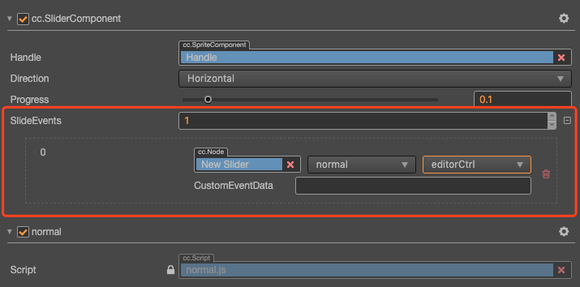

# Slider Component Reference

Slider is a component for the production of UI components such as volume adjustment.


Click the __Add Component__ button at the bottom of the __Inspector__ panel and select __UI/Slider__ to add the Slider component to the node.

To use `Slider`, please refer to the [Slider API](https://docs.cocos.com/creator/3.0/api/en/classes/ui.slider.html) documentation and the [slider](https://github.com/cocos-creator/test-cases-3d/tree/master/assets/cases/ui/10.slider) scene of the test-cases-3d project.

## Slider Properties

| Properties     | Function Explanation |
| -------------- | -----------          |
| Handle         | The button part of the __Slider__ that allows to adjust value by sliding the button  |
| Direction      | The direction of the slider, including __Horizontal__ and __Vertical__ |
| Progress       | Current progress value, the value range is 0 ~ 1  |
| SlideEvents    | __Slider__ component event callback function  |

## Slider Event



For event structure you can refer to the [Button](./button.md) documentation.

The __Slider__ event callback has two parameters, the first one is the Slider itself and the second is the `customEventData`.

## Detailed Explanation

The __Slider__ is usually used to adjust the value of the UI (for example, volume adjustment), and its main component is a slider button, which is used for user interaction. You can adjust the value of the __Slider__ through this part.

Usually a __Slider__ node tree as shown below:


## Add a callback by script code

### Method one

The event callback added by this method is the same as the event callback added by the editor, all added by code. First you need to construct a `EventHandler` object, and then set the corresponding `target`, `component`, `handler` and `customEventData` parameters.

```ts
import { _decorator, Component, Event, Node, SliderComponent, EventHandler } from "cc";
const { ccclass, property } = _decorator;

@ccclass("example")
export class example extends Component {
    onLoad(){
        const sliderEventHandler = new EventHandler();
        // This Node is the node to which your event processing code component belongs
        sliderEventHandler.target = this.node;
        // This is the code file name
        sliderEventHandler.component = 'example';
        sliderEventHandler.handler = 'callback';
        sliderEventHandler.customEventData = 'foobar';

        const slider = this.node.getComponent(SliderComponent);
        slider.slideEvents.push(sliderEventHandler);
    }

    callback(event: Event, customEventData: string){
        // The event here is a Touch Event object, and you can get the send node of the event by event.target
        // The customEventData parameter here is equal to the "foobar" you set before
    }
}
```

### Method two

By `slider.node.on('slide', ...)` way to add.

```ts
// Suppose we add event handling callbacks to the onLoad method of a component and perform event handling in the callback function:

import { _decorator, Component, SliderComponent } from "cc";
const { ccclass, property } = _decorator;

@ccclass("example")
export class example extends Component {
    @property(SliderComponent)
    slider: SliderComponent | null = null;
    onLoad(){
       this.slider.node.on('slider', this.callback, this);
    }

    callback(slider: SliderComponent){
        // The parameter of the callback is the Slider component. Note that events registered this way cannot pass customEventData
    }
}
```
