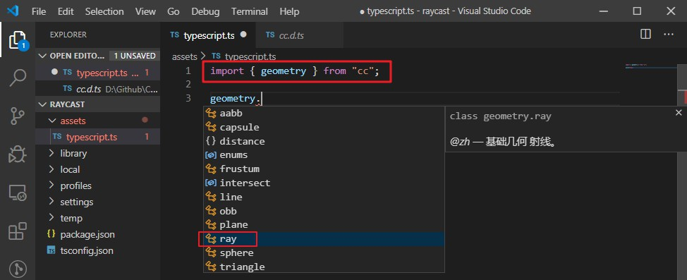

# 射线检测

射线检测是非常重要的功能，常常用来判断各种情况。其本质是对一条射线和另一个形状进行 **相交性判断**，如下图所示。


## 构造射线

射线 __ray__ 处于 __cc__ 模块的 __geometry__ 命名空间下，因此访问 __ray__ 需要先导入 __geometry__ ：

```ts
import { geometry } from "cc";
```



射线 __ray__ 由 **起点** 和 **方向** 组成，构造一条射线有以下几种比较常见的方法：

1. 通过 __起点__ + __方向__，__ray__ 的构造函数或静态接口 `create`：

    ```ts
    import { geometry } from "cc";
    const { ray } = geometry;
    // 构造一条从（0，-1，0）出发，指向 Y 轴的射线
    // 前三个参数是起点，后三个参数是方向
    const outRay = new ray(0, -1, 0, 0, 1, 0);

    // 或者通过静态方法 create
    const outRay2 = ray.create(0, -1, 0, 0, 1, 0);
    ```

2. 通过 __起点__ + __射线上的另一点__，__ray__ 的静态接口 `fromPoints`:

    ```ts
    import { geometry, Vec3 } from "cc";
    // 构造一条从原点出发，指向 Z 轴的射线
    const outRay = new geometry.ray();
    geometry.ray.fromPoints(outRay, Vec3.ZERO, Vec3.UNIT_Z);
    ```

3. 用相机构造一条从相机原点到屏幕某点发射出的射线：

    ```ts
    import { geometry, Camera } from "cc";
    const { ray } = geometry;
    // 此处假设已经有 cameraCom 的引用了
    const cameraCom: Camera;
    // 获得一条途径屏幕坐标（0，0）发射出的一条射线
    const outRay = new ray();
    cameraCom.screenPointToRay(0, 0, outRay);
    ```

    **注意**：
    - 首先需要获取一个相机组件或者相机实例的引用。
    - 相机组件和相机实例两者暴露的接口参数顺序不一样。

## 接口介绍

Cocos Creator 提供了一套基于物理引擎的射线检测功能。

但需要注意的是，检测的对象是物理碰撞器，在场景面板上与之对应的是碰撞器组件，例如 __BoxCollider__。

目前接口由 __PhysicsSystem__ 提供，有以下两类：

- `raycast` : 检测所有的碰撞体，返回布尔值, 表示是否检测成功。
- `raycastClosest` ：检测所有的碰撞体，同样返回布尔值。

参数说明：

- `worldRay`：世界空间下的射线
- `mask`：用于过滤的掩码，可以传入需要检测的分组
- `maxDistance`：最大检测距离，目前请勿传入 `Infinity` 或 `Number.MAX_VALUE`
- `queryTrigger`：是否检测触发器

## 获取结果

获取以上接口的检测结果，需分别通过以下方式：

- 获取 `raycastAll` 的检测结果：`PhysicsSystem.instance.raycastResults`
- 获取 `raycastClosest` 的检测结果：`PhysicsSystem.instance.raycastClosestResult`

**注意**：返回对象是只读并且复用的，每次调用检测接口后会更新相应结果。

## 结果存储的信息

信息由 `PhysicsRayResult` 进行存储，主要有以下信息：

- `collider`：击中的碰撞器
- `distance`：击中点与射线起点的距离
- `hitPoint`：击中点（世界坐标系中）
- `hitNormal`：击中点所处面的法线（世界坐标系中)
