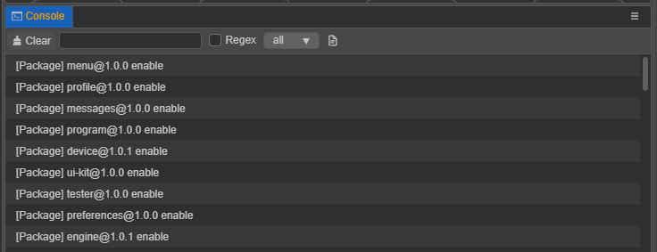
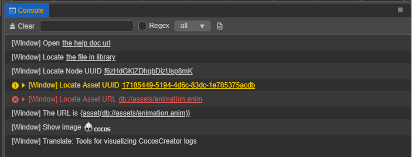

# Console



**Console** outputs editor or engine information, including **log**, **warnings**, and **errors**. Different types of information will be displayed in different colors.

The colors displayed are as follows:

- **console.log()**: output log, <font color=#b6b6b6>gray text</font>, the content that developers in the editor and plug-in feel necessary to print to the console.

  

- **console.warn()**: output warning, <font color=#ebbe09>yellow text</font>, the abnormal situation encountered by the program that does not affect the result.

  

- **console.error()**: output error, <font color=#dd3c43>red text</font>, the exception encountered during operation that will affect the result, the severity is the highest.

  

## Panel operation

The functions of the top toolbar are:

- Clear all logs in the current console.
- Enter text fuzzy search.
- Whether to convert the input text to regular search.
- Select the type of log to display.
- Open the log file backed up on the disk, and the file data will be reset every time the editor starts.

  

## Parameter Settings

Some parameters of the console are configured in **Preferences**. Please refer to the extended settings in the [Preferences](../preferences/index.md) documentation.


## Content Output Rules

In order to facilitate the location of files, nodes or resources, and provide a quick step to the help document, some recognition of the content and adding actions is required. Specific requirements are as follows:

- Redirect links according to url.
- Display pictures according to url.
- Locate Asset resource according to url or uuid.
- Locate the Node node according to uuid.
- Locate the script file according to the disk file path path.
- Output text in the corresponding language.

### Data Format

- `{type[text](url)}`
- `{type(text | url | uuid | path)}`

### Data format description

- Match the characters in `{}` as a whole.
- `[text]` is optional for expansion input.
- When `type` exists, it is not case sensitive.
- When `type` does not exist, the original data is output.

- `types` has:
   - `link`: external redirect link.
   - `Image`: display picture.
   - `Asset`: locates resources.
   - `node`: locates the node.
   - `I18n`: multilingual translation.

### Example

```sh
console.log('Open {link[the help doc url](https://docs.cocos.com/creator/manual/en/editor/console/)}');
console.log('Locate {link[ the file in library](D:/cocos-creator/a/library/36/36b55a90-1547-4695-8105-abd89f8a0e5f.js)}');
console.log('Locate Node UUID {node(f6zHdGKiZDhqbDizUsp8mK)}');
console.warn('Locate Asset UUID {asset(17185449-5194-4d6c-83dc-1e785375acdb)}');
console.error('Locate Asset URL {asset(db://assets/animation.anim)}');
console.log('The URL is {asset[{asset(db://assets/animation.anim)}](db://assets/animation.anim)}');
console.log('Show image {image(https://forum.cocos.org/images/logo.png)}');
console.log('Translate: {i18n(console.description)}');
```

Which looks like this in the Console window:


